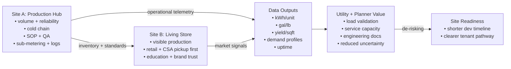

# ABCFarmsIL — Model Fit Map (1-page)
*(System + KPI map for partners, grants, and site owners)*

## What this is (in one line)
A **modular, removable “proxy industrial user + local food node”** that activates underused/development-ready parcels, **validates utilities with real loads**, and produces **measurable outcomes** without locking in future site use.

---

## System architecture (how it works)
### Two-site operating logic
- **Site A — Production Hub**: modules + cold chain + workflows + QA + data backbone
- **Site B — “Living Store”**: visible growing + CSA/retail anchor + community trust + (later) delivery

---

## Primary levers (what changes the system)
1. **Utility tie-ins + sub-metering** → converts infrastructure into *measured performance*
2. **Always-on load profiles** → creates *real* demand data (not estimates)
3. **Grid-interactive behaviors (optional)** → demonstrates controllability (shift/storage/control)
4. **Reversible deployment** → enables pilots on constrained parcels without “site lock-in”
5. **Two-site synchronization (shared SOPs)** → makes scale/train/quality repeatable

---

## Boundaries (non-negotiables)
- **No permanent buildings / foundations / fixed structures**
- **Modules removable; exit protocol + site restoration**
- **Demonstration mode can run without public retail (when required)**

---

## Leave-behind package (what the site owner / utility keeps)
A lightweight deliverable that **reduces uncertainty for the next tenant** and accelerates permitting / planning.

**Contents (sample table of contents)**
- **1. Executive summary** (what was deployed, where, when)
- **2. Utility tie-in record** (single-line diagram, photos, breaker/panel notes)
- **3. Sub-metering setup** (meter IDs, locations, logging method)
- **4. Demand profile report** (hourly curves, peak kW, kWh/day, uptime)
- **5. Optional grid-interactive results** (what loads were shifted and by how much)
- **6. Operating notes** (maintenance cadence, failure modes observed)
- **7. Decommission + restoration checklist** (what is removed, what remains, site left condition)

---

## KPI dashboard (the measurement spine)
*Use this exact KPI spine across grants, partners, demos, and internal ops.*

| KPI | Unit | Why it matters | Minimum cadence |
|---|---:|---|---|
| Energy use | kWh/day | baseline load + cost | daily |
| Peak demand | kW | utility capacity + sizing | daily (max) |
| Energy intensity | kWh / lb (or per tray) | efficiency + scaling credibility | weekly |
| Water use | gal/day | site impact + ops stability | daily |
| Water intensity | gal / lb | comparability + stewardship | weekly |
| Output | lb/week + yield/sqft | performance + replication | weekly |
| Cold-chain compliance | % time in range | food safety + shrink control | weekly |
| Shrink / waste | % of output | margin + operational maturity | weekly |
| Uptime | % | reliability signal | weekly |
| Downtime causes | top 3 | learning loop | weekly |
| Labor intensity | labor hours / lb | founder bottleneck early warning | weekly |

---

## Feedback loops (what to watch)
- **Learning loop (good):** sub-metering → tuning → lower kWh/unit → stronger grant story → easier replication
- **Founder bottleneck (risk):** two sites → split attention → quality slips → shrink rises → cash stress
  - *Countermeasure:* dedicated Site B manager early + standardized SOPs
- **Rebound risk (watch):** growth in demand → energy use rises → must keep intensity (kWh/lb) improving

---

## 90-day proof sequence (partner-friendly)
1. **Days 0–30:** secure permissions + confirm utilities + lock layouts + staffing
2. **Days 30–90:** steady cadence + limited retail/CSA + telemetry + baseline KPIs
3. **Day 90+:** publish report + define replication playbook (or exit cleanly)

---

## Resonance fit (4 lenses)
- 🌍 **Climate Clarity:** strong (measurable electrified production + demand profiles)
- 🌱 **Regenerative Systems:** medium (reversibility strong; add closed-loop nutrient/water proof)
- 🧭 **Eco-Ethics:** medium-strong (clear boundaries + low-risk siting; add equity/access one-pager)
- 💨 **Planetary Breath:** strong signal (explicit staffing/pace realism; track labor intensity + burnout risk)

---

## Highest-leverage upgrades (to “lock” the model)
1. **One unified KPI sheet** used across all narratives (site readiness + retail + demo)
2. **Grid-interactive demo mode** (2–3 controllable behaviors with logged outcomes)
3. **Standard “leave-behind package”**: validated utility connections + engineering docs + demand profiles
4. **QA/traceability appendix** (reduces perceived food-safety risk)
5. **Equity + access module** for the living store (simple, explicit, measurable)

